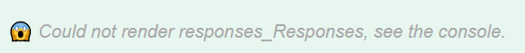

# **API Node.js - Hack Tools**

Cette API propose plusieurs endpoint permettant d'utiliser ou de créer différent outils de hacking (ddos, phishing, génération de mots de passe, etc.), ainsi qu'une gestion des utilisateurs de l'api. Ce guide vous aidera à configurer et exécuter l'API en local et précisera aussi comment l'utiliser en ligne.

---

## **Table des matières**
1. [Prérequis](#prérequis)
2. [Installation](#installation)
   - [Étape 1 : Cloner le projet](#étape-1--cloner-le-projet)
   - [Étape 2 : Accéder au répertoire du projet](#étape-2--accéder-au-répertoire-du-projet)
   - [Étape 3 : Installer les dépendances](#étape-3--installer-les-dépendances)
3. [Configuration](#configuration)
   - [Étape 4 : Configurer les variables d'environnement](#étape-4--configurer-les-variables-denvironnement)
4. [Démarrage du serveur](#démarrage-du-serveur)
   - [Étape 5 : Lancer l'API](#étape-5--lancer-lapi)
5. [Utilisation](#utilisation)
   - [Documentation de l'API](#documentation-de-lapi)
   - [Authentification](#authentification)
   - [Gestion des utilisateurs](#gestion-des-utilisateurs)
   - [Outils](#outils)
   - [Logs](#logs)
   - [Bonnes pratiques](#bonnes-pratiques)
6. [Utilisation en ligne](#utilisation-en-ligne)
   - [URL principale de l'API](#url-principale-de-lapi)
   - [Swagger UI](#swagger-ui)
   - [Récupération du token JWT](#🔑--récupération-du-token-jwt)
   - [Gestion des permissions](#⚙️--gestion-des-permissions)
7. [Dépendances principales](#dépendances-principales)
8. [Contributions](#contributions)
9. [Licence](#licence)

---

## **Prérequis**

Avant de commencer, assurez-vous d'avoir les éléments suivants installés sur votre machine :

- **Node.js** (version 14 ou plus) : [Télécharger Node.js](https://nodejs.org)
- **npm** (ou **yarn**) : Inclus avec Node.js
- **MongoDB** : Une base de données MongoDB (locale ou hébergée, comme [MongoDB Atlas](https://www.mongodb.com/atlas))
- **Git** : Pour cloner le dépôt

---

## **Installation**

### Étape 1 : Cloner le projet
Clonez ce dépôt Git sur votre machine locale :

```bash
git clone https://github.com/votre-utilisateur/votre-repo.git
cd votre-repo
```
### Étape 2 : Accéder au répertoire du projet

Déplacez-vous dans le répertoire cloné :

```bash
cd votre-repository
```


### Étape 3 : Installer les dépendances

Installez toutes les dépendances nécessaires en utilisant `npm` :

```bash
npm install
```

Cette commande téléchargera et installera toutes les dépendances définies dans le fichier `package.json`.

### Étape 4 : Configurer les variables d'environnement

Créez un fichier `.env` à la racine du projet en utilisant le fichier `.envExample` comme modèle :

```bash
cp .envExample .env
```

Ouvrez le fichier `.env` dans un éditeur de texte et modifiez les valeurs en fonction de votre configuration locale (par exemple, vos informations de connexion à la base de données).

---

### Étape 5 : Lancer l'API

Pour démarrer l'API en mode développement, utilisez la commande suivante :

```bash
npm run dev
```

Pour démarrer l'API en mode production, utilisez la commande suivante :

```bash
npm start
```

Une fois l'API démarrée, elle sera accessible par défaut à l'adresse suivante : `http://localhost:5000`.


## **Utilisation**

### Documentation de l'API

Une fois l'API démarrée, accédez à la documentation interactive via Swagger UI à l'adresse suivante :

http://localhost:5000/api-docs

Swagger fournit une interface utilisateur permettant de tester toutes les routes disponibles, avec des exemples de requêtes et de réponses.

### Fonctionnalités principales

1. **Authentification** :
   - Enregistrez un nouvel utilisateur via `/api/auth/register`.
   - Connectez-vous avec `/api/auth/login` pour obtenir un token JWT.

2. **Gestion des utilisateurs** :
   - Promouvez un utilisateur au rôle administrateur avec `/api/auth/promote`.
   - Attribuez des permissions spécifiques à un utilisateur via `/api/auth/permissions`.

3. **Outils** :
   - Vérifiez un email : `/api/tools/check_email`.
   - Générez un mot de passe sécurisé : `/api/tools/generate-password`.
   - Lancer une attaque DDoS ou créer une page de phishing...(voir Swagger).

4. **Logs** :
   - Visualisez tous les logs (administrateurs uniquement) : `/api/logs/all`.
   - Récupérez les logs pour un utilisateur spécifique ou une fonctionnalité.

### Bonnes pratiques

- **Tokens JWT** : Toute requête sécurisée nécessite un header `Authorization` avec un token JWT valide.
- **Limiter les permissions** : Configurez soigneusement les permissions des utilisateurs pour éviter des abus.
- **Surveiller les logs** : Utilisez les logs pour auditer les actions dans l'API.

---

## **Utilisation en ligne**

Si vous souhaitez utiliser cette API déployée en ligne, voici les informations nécessaires :

### **URL principale de l'API**
L'API est déployée à l'adresse suivante : 
Voici une section pour l'utilisation en ligne de l'API, sous forme markdown :

markdown
Copier le code
## **Utilisation en ligne**

Si vous souhaitez utiliser cette API déployée en ligne, voici les informations nécessaires :

### **URL principale de l'API**
L'API est déployée à l'adresse suivante :

http://31.207.34.16:5000


Toutes les requêtes doivent être basées sur cette URL. Par exemple :
- **Enregistrer un utilisateur** : `POST http://31.207.34.16:5000/api/auth/register`
- **Consulter les logs** (administrateurs uniquement) : `GET http://31.207.34.16:5000/api/logs/all`

### **Swagger UI**
La documentation complète et interactive de l'API est accessible en ligne via Swagger :

http://31.207.34.16:5000/api-docs


Swagger vous permet de tester directement les endpoints en fournissant les données nécessaires et d'afficher les réponses de l'API.

## ⚠️ **Conseils pour l'utilisation en ligne** ⚠️

### 🔑 **Récupération du token JWT**
Pour utiliser les fonctionnalités sécurisées de l'API, vous devez obtenir un token JWT valide :
1. Enregistrez-vous via l'endpoint `/api/auth/register` si vous n'avez pas encore de compte.
2. Connectez-vous via `/api/auth/login` pour récupérer un token JWT.

Ce token sera automatiquement ajouté aux requêtes effectuées depuis Swagger UI grâce à un script. **Cependant, si vous oubliez de vous connecter ou de fournir un token valide, vous obtiendrez une erreur :**



```text
Could not render responses_Responses, see the console.
```

## ❗ **Important : Bien se connecter avant de tester les routes**

Si vous obtenez une erreur dans Swagger UI, suivez ces étapes :

1. Rechargez la page Swagger : [http://votre-url/api-docs](http://votre-url/api-docs).
2. Connectez-vous avec votre compte via l'endpoint `/api/auth/login`.
3. Vous pouvez tester les endpoints.

---

### ⚙️ **Gestion des permissions**

- Les endpoints sécurisés nécessitent que l'utilisateur connecté dispose des permissions adéquates.
- Vérifiez ou attribuez les permissions via l'endpoint `/api/auth/permissions` avant d'accéder aux fonctionnalités spécifiques.

---


